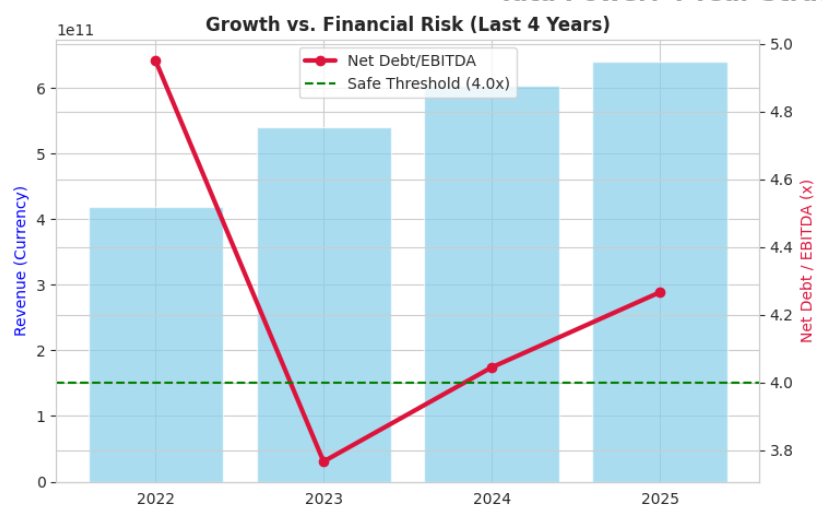
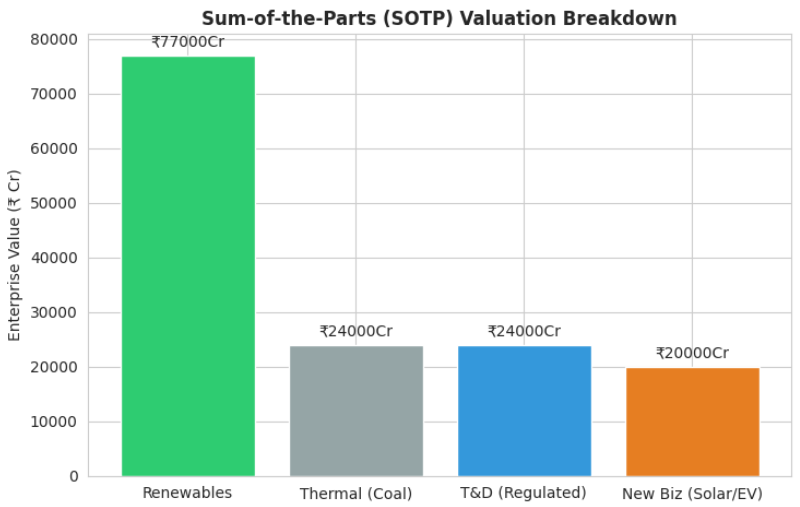

# Strategic Equity Research & Valuation: Tata Power 

### **Investment Verdict: BUY on Dips | SOTP Target: ₹485 | Risk: High Sensitivity**

## 📊 Project Overview
This repository contains a quantitative financial analysis and equity valuation model for **Tata Power Company Ltd.**, India's largest integrated power utility. Moving beyond static Excel models, this project utilizes **Python (Pandas, yfinance)** to fetch real-time financial data, automate ratio analysis, and perform rigorous sensitivity testing. The analysis focuses on the company's strategic pivot from thermal energy to a renewable-led "Green Platform."

## 🔑 Key Findings & Investment Thesis

### 1. Solvency & Leverage Analysis
* **Current Net Debt / EBITDA:** **4.27x**
* **Analysis:** While the company is deleveraging from historical highs (>5.5x), the current ratio of 4.27x reflects the aggressive capital expenditure (Capex) cycle for the new 4.3GW Solar Cell & Module manufacturing plant. This indicates that while growth is visible, the balance sheet remains leveraged, requiring close monitoring of cash flows.

### 2. Valuation: The "Sum-of-the-Parts" (SOTP) Alpha
* **Methodology:** The company was valued by segregating its business units (Thermal, Renewables, T&D) and assigning distinct EV/EBITDA multiples.
* **Bull Case Target (SOTP):** **₹485 / share**
* **Logic:** This target assumes a re-rating of the Renewable business to **14x EV/EBITDA**, aligned with pure-play peers like Adani Green, given the strong government policy tailwinds (PM Surya Ghar, ALMM).

### 3. Risk Assessment (The "Bear Case")
* **DCF Floor Price:** **₹60 / share** (Extreme Bear Scenario)
* **Stress Test:** The Discounted Cash Flow (DCF) model reveals high sensitivity to the Cost of Capital. In a scenario where **WACC spikes to 13%** (due to interest rate hikes) and **Terminal Growth drops to 3%**, the intrinsic value erodes significantly. This highlights the high "Duration Risk" inherent in long-gestation power projects.

## 🛠️ Technical Implementation
The core analysis is powered by the `project.py` module, which automates:
* **Data Extraction:** Fetches last 4 years of granular financial statements via `yfinance` API.
* **Financial Modeling:**
    * **Deleveraging Trend:** Visualizes Revenue Growth vs. Net Debt/EBITDA trajectory.
    * **SOTP Valuation:** Aggregates segment-wise Enterprise Value to derive Equity Value.
    * **Monte Carlo-style Sensitivity:** Generates a "Football Field" heatmap testing 25 valuation scenarios.

## 📈 Visualizations
*(Generated by the Python script)*

| Deleveraging Trajectory | Sum-of-the-Parts Valuation Breakdown |
| :---: | :---: |
|  |  |

## 🚀 How to Run the Model
1.  **Clone the Repository:**
    ```bash
    git clone https://github.com/Akshat-Singh-Kshatriya/Tata-Power-Equity-Research.git
    ```
2.  **Install Dependencies:**
    ```bash
    pip install pandas yfinance matplotlib seaborn
    ```
3.  **Run the Analysis:**
    ```bash
    python analysis_script.py
    ```


